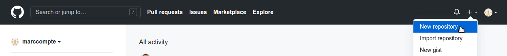
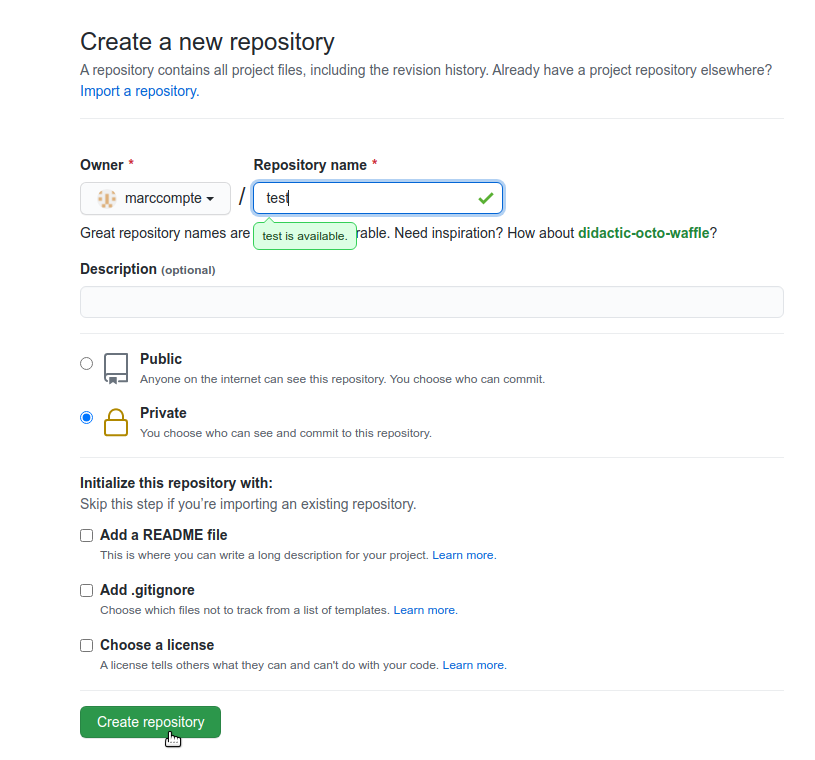
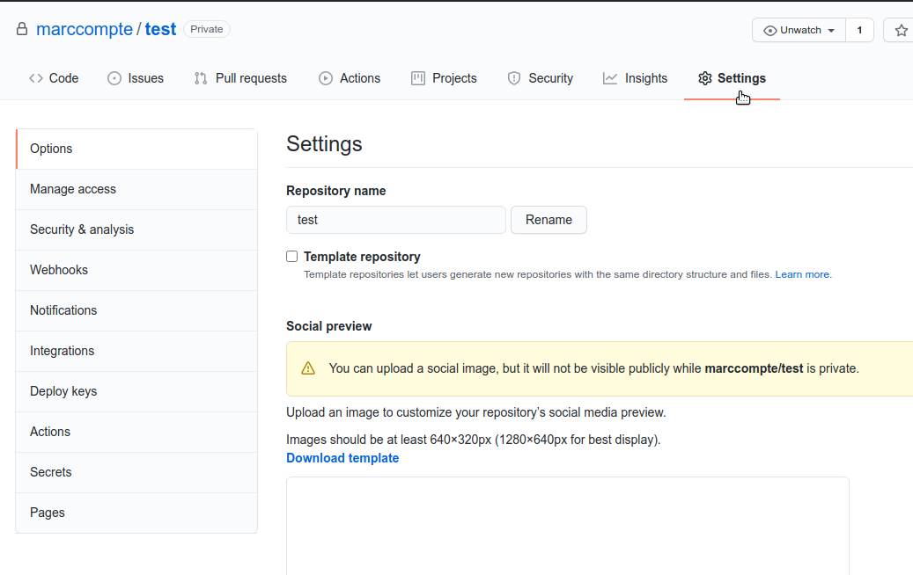
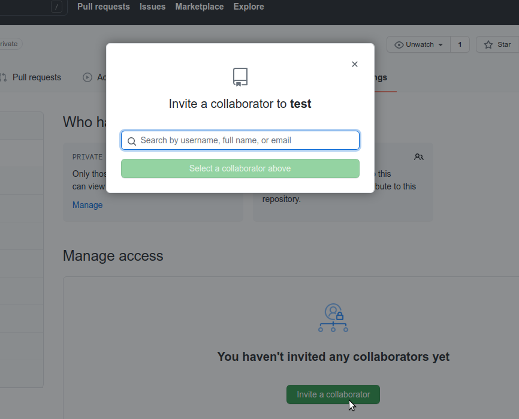
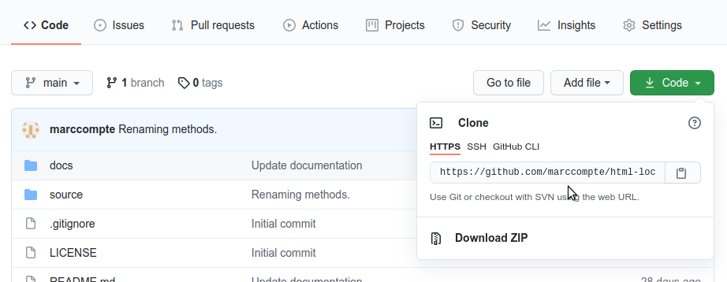

# Using GIT

This guide explains how to setup and use a GIT repository on GitHub to keep track of the changes and as a delivering method.

Author: Marc Compte (marc@compte.cat)

## Create an account

Create an account on https://github.com.

## Setting up a new GIT repository

Once you are registered and signed in you have to create a new repository.

Give a name to the repository and set it to private or public.

## Giving privileges to developers

Once the repository is created, give privileges to the developers so they can read and write on this repository. To do so, go to **Settings**.

Then click on **Manage access** and add the developer. In my case, type the email `marc@braquets.cat`.

I will then add the current code to this repository.

## Getting the code from the repository the first time (cloning)

Once the code is in the repository you can get it by using GIT.

1. Check if you have already GIT in your computer. Type:

`git --version`

If an error appears, install GIT:

https://git-scm.com/book/en/v2/Getting-Started-Installing-Git

2. Clone the repository.

The command to clone (download) a repository is:

`git clone {repo path}`

To get the repository path you can go to the repository on GitHub and, in the **Code** tab, click on the green **Code** dropdown button on the right.

Then select the option HTTPS and copy the path below.

Example:

`git clone https://github.com/marccompte/test.git`

This will ask for your credentials and, if successful, will create a directory with the name of the repository (in the example, `test`).

## Getting updates

The command to get any new changes on the repository is:

`git pull`

You have to execute it from within the directory named after the repository (the one having a hidden directory `.git`).

## Making changes

If you change the files in your local copy of the repository (for styling purposes, for instance) you may experience difficulties when getting the new updates from GitHub repository.

Before you do an update (`git pull`) it is often a good idea to check if you made any changes. You can do that with:

`git status`

If there are changes but they were just for testing purposes, you can remove all the changes with the following command:

`git stash`

If you want to keep those changes but, at the same time, get the new updates from GitHub you can first `stash` your local changes, then `pull` and finally get back your local stashed changes with:

`git stash pop`

GIT will take care of merging the files that have changes both on your local copy and the server. In some situations, GIT may say it was not able to do an automatic merging.

In that case, you may have to do the merging manually. This means opening the file and checking its contents. If you find yourself in this situation we may have to resolve it together.
